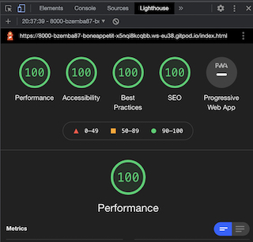
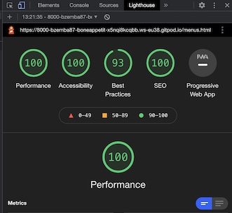
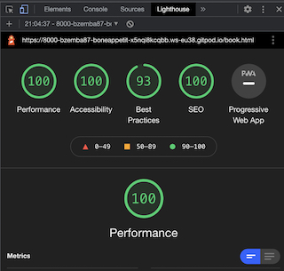
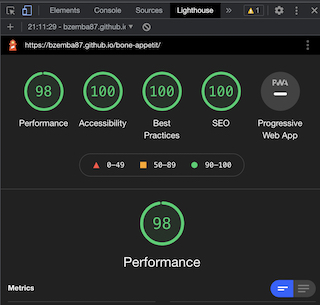
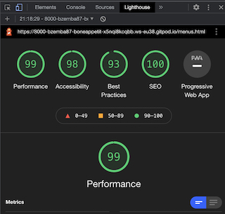
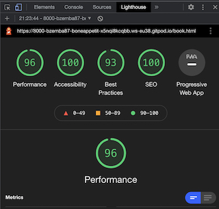

<h1 align="center">Bone Appetit</h1>

[View the live project here.](https://bzemba87.github.io/bone-appetit/)

This is a website for a dog cafe in London named Bone Appetit.  The purpose of the website is to provide potential or exisitng cafe customers with helpful information about the cafe, such as:  food available on the menus for both dogs and humans, the cafe's location, contact details, social media accounts and how to book.  It is designed to be responsive and accessible on a selection of devices, making it easy to navigate for cafe customers.

<h2 align="center"></h2>

## User Experience

User Stories

First Time Visitor Goals

1.  As a first time visitor, I want to easily understand the main purpose of the site and learn more about a dog cafe in London.
2.  As a first time visitor, I want to be able to easily navigate the site to find the food menu and booking request form.
3.  As a first time visitor, I want to be able to easily find the cafe's location and visit it's social media accounts linked to the site to see their posts, posts they are tagged in by customers and how many followers they have.

Returning Visitor Goals

1.  As a returning visitor, I want to find the contact information for any general queries or queries about an existing booking I may have.
2.  As a returning visitor, I want to check the menu again and see if it has been updated.
3.  As a returning visitor, I want to visit the social media links to check any new posts.
4.  As a returning visitor, I want to check the cafe opening hours and make a booking.

Design

Colour Scheme:

- The colours I chose for Bone Appetit are #FFF6FE (very light shade of magenta); #FE94AD (light red); black and #36454F (charcoal).  As it is a cafe website, the colours have to provide a taste of the cafe's personality which is a good balance between being fun and attractive but also professional.  

Typography:

 - The Open Sans font is used for the body and Roboto Slab font is used for the headings and footer.  Sans-serif is selected as the fallback font if there is a problem with importing either font to the site.  Both fonts have been imported from Google Fonts and are easy to read and look nice and sleek.

Imagery:

- The background image on the home page is eye catching and relevant for a dog cafe site with a purpose to attract dog lovers.  It's modern and minimalist look sets the tone for the entire cafe.
        
Wireframes - Desktop:
- [Home](https://github.com/BZemba87/bone-appetit/blob/main/home-wireframe-desktop.jpg)
- [Menus](https://github.com/BZemba87/bone-appetit/blob/main/menus-wireframe-desktop.jpg)
- [Book](https://github.com/BZemba87/bone-appetit/blob/main/menus-wireframe-desktop.jpg)

## Features 

- The site consists of 3 main pages - Home, Menus and Book.
- Each page has the same layout - Header (title/icon), Navigation Bar (links to other pages), Body (text content, images and booking form), Footer (social media icons/links, opening hours, location and contact information).
- User can click title/icon on any page and it will take them back to the Home page.  

Navigation Bar:

<h2 align="center"></h2>

Footer:

<h2 align="center"></h2>

Layout and Content:

- The Home page has some welcome text and a background image.
- The Menus page has menus available in the cafe for dogs and humans plus a little note about food intolerances and an image.
- The Book page has a booking form to reserve a table that requires name, email, phone, date, time and a dropdown menu to select number of guests.   An image is alongside the booking form.

Hover Effect on Links and Form Button:

- Indicates to the user the location of the mouse whilst navigating the menu on the navigation bar.
- A background colour (rgba(254,148,173,0.7) has been set for active links so the user knows which page they are currently on.
- A background colour (#FE94AD) has been set for "Request Booking" button on booking form for when the user hovers over it.  

<h2 align="center"></h2>

Reserve Your Table Form:

- Form validation requests user to input correct information in input fields when the 'Request Booking' button is pressed - this stops the user from submitting incorrect information.  

<h2 align="center"></h2>

## Languages, Libraries and Programs Used

- [HTML5](https://en.wikipedia.org/wiki/HTML5)
- [CSS3](https://en.wikipedia.org/wiki/CSS)

- [Google Fonts:](https://fonts.google.com/)
    - Google Fonts was used to import the 'Roboto Slab' font and 'Open Sans' font into the style.css file which is used on all pages throughout the site.
- [Font Awesome:](https://fontawesome.com/)
    - Font Awesome was used in the footer for social media links on each page and on the menu page for the menu headings.

- [Git](https://git-scm.com/)
    - Git was used for version control, commiting and pushing to GitHub.
- [GitHub:](https://github.com/)
    - GitHub is used to store the repositories, files and images after being pushed from Git.

- [Balsamiq:](https://balsamiq.com/)
    - Balsamiq was used to create the [wireframes] during the design process.
- [Am I Responsive:](http://ami.responsivedesign.is)
    - Used to test responsiveness of the website at different screen sizes.

- [Pexels:](https://www.pexels.com/)
        - Obtained pictures used in website from Pexels.

- CHROME Developer tools
    - For checking compatibilty, troubleshooting and editing code.

    ## Testing

I ran my code through the W3C Markup Validator and W3C CSS Validator for every page of my site.

Errors:

I was given the following error on my menus.html file:

- Element < br > not allowed as a child of element < ul > (I used this for spacing between menu items on the menus page).  I have since corrected this error by removing all < br > elements and replaced them with padding for the lines that require space.  

I also had the following warning for 4 lines in my style.css file:

- Family names containing whitespace should be quoted. If quoting is omitted, any whitespace characters before and after the name are ignored and any sequence of whitespace characters inside the name is converted to a single space.

I fixed this by putting ' ' around my Roboto Slab font.  

I am now receiving no errors in my code on either validator.   Please see results below:

- [W3C CSS Full Report](https://jigsaw.w3.org/css-validator/validator?uri=https%3A%2F%2Fbzemba87.github.io%2Fbone-appetit%2F&profile=css3svg&usermedium=all&warning=1&vextwarning=&lang=en)
- [W3C HTML Full Report for Home](https://validator.w3.org/nu/?doc=https%3A%2F%2Fbzemba87.github.io%2Fbone-appetit%2Findex.html)
- [W3C HTML Full Report for Menu](https://validator.w3.org/nu/?doc=https%3A%2F%2Fbzemba87.github.io%2Fbone-appetit%2Fmenus.html)
- [W3C HTML Full Report for Book](https://validator.w3.org/nu/?doc=https%3A%2F%2Fbzemba87.github.io%2Fbone-appetit%2Fbook.html)

## Testing User Stories from User Experience

### First Time Visitor Goals
1.  I want to easily understand the main purpose of the site and learn more about a dog cafe in London.
- Upon entering the site, users are greeted with easily readable welcome text explaining the purpose of the site, a clear and obvious title and a clean navigation bar to help the user find the page they need to view.  

2.  I want to be able to easily navigate the site to find the food menu and booking request form.
- Users can instantly see the navigation bar when they arrive at the site as the font is very sleek and easy to read. With only 3 links (home, menus and book) to choose from, users will very quickly realise that it's very easy to move around the site and find what they are looking for.  A background color activates for the link of the page the user is currently viewing.  

3.   I want to be able to easily find the cafe's location and visit it's social media accounts linked to the site to see their posts, posts they are tagged in by customers and how many followers they have.
- Every page has the same layout so users can easily find the social media links in the footer (which will open up a new tab when clicked) so they can get a feel for the atmosphere of the cafe through the cafe's posts and the cafe customer's posts.  
-  The cafe's location is in the exact same place in the footer of every page the user will be viewing.

### Returning Visitor Goals
1.  As a returning visitor, I want to find the contact information for any general queries or queries about an existing booking I may have.
- This information is clearly displayed in the footer of every page.  

2.  As a returning visitor, I want to check the menu again and see if it has been updated.
- The navigation bar clearly displays the link to the "Menus" page so users can easily check what they or their dog would like to eat in advance of their visit or check if there have been any alterations to the menu.

3.  As a returning visitor, I want to visit the social media links to check any new posts.
- Users can easily navigate the site to find the social media links in the footer of each page to check the cafe's latest social media posts.

4.  As a returning visitor, I want to check the cafe opening hours and easily find the booking form to make a booking.
-  The opening hours is clearly displayed in the footer of every page of the website and the booking form is easily located by clicking "Book" on the navigation bar.  

## More Testing

Devices:
- The website was tested on Google Chrome, Mozilla Firefox, Safari and Internet Explorer.
- The website was viewed on a variety of devices such as desktop, HP Pavillion laptop, MacBook Air, iPad 10.2, iPhone 12 mini, Samsung Galaxy s10e.

Functionality:
- Each link has been hovered over and clicked on multiple times to ensure they work.
- Each page and image loads correctly on all devices.
- Social media links have been clicked on multiple times to ensure they work and open up a new tab as expected.
- Title/icon links back to Home page as expected when clicked anywhere on the site.

## Lighthouse

- Each live page has been tested on Chrome Lighthouse for Desktop and Mobile:

## Home (Desktop)

<h2 align="center"></h2>

## Menus (Desktop)

<h2 align="center"></h2>

## Book (Desktop)

<h2 align="center"></h2>

## Home (Mobile)

<h2 align="center"></h2>

## Menus (Mobile)

<h2 align="center"></h2>

## Book (Mobile)

<h2 align="center"></h2>

## Accessibility 

- Each page has been tested on wave.webaim.org for accessibility.
- Click [here](https://wave.webaim.org/report#/https://bzemba87.github.io/bone-appetit/index.html) for full report.

## Solved Errors 

- The navigation links wouldn't space out evenly along the bar.  I fixed this issue by using display: flex and justify-content: space-between.  Now the links are inline and evenly spaced.  

- The booking form on the book page was sitting underneath the image and could not be positioned to the right of it using float.  I managed to position it correctly beside the image by instead using display: flex, flex-direction: row and justify-content: space-evenly.

- There was an issue with the background color for the Human Menu heading where it was appearing in a larger block on iPhone SE and pushing the fork and knife icon down on to the next line.  This was fixed by removing the letter spacing in the media queries for smaller screens.  

## Bugs

- The background image on the home page sometimes overlaps the scroll bar in Dev Tools.  
- The select dropdown and the request button on the booking form appear smaller than the other input fields on iPad 10.2, iphone 12 mini and in a Safari browser.
- Without making any changes to any of the code, "puppuccino" is now not displaying in line with "coffee, tea or fresh juices" on Samsung s10e device, however, when checking the size of the device in Dev Tools it is showing correctly.  I have tried adding padding to fix this in the media query but it hasn't worked.  

## Deployment

GitHub Pages

The site was deployed to GitHub Pages with the following steps:

- Log in to GitHub and locate the GitHub Repository
- At the top of the Repository (not top of page), locate the "Settings" Button on the menu.
- Scroll down to "Github Pages" where it says "Pages settings now has its own dedicated tab!" - click on the link.
- Under "Source", click the dropdown called "None" and select "Main Branch".
- The page will automatically refresh and the now published site link in "GitHub  Pages" will appear.

How to Fork a Repository:

- Log in to GitHub and go to the repository (https://github.com/BZemba87/bone-appetit).
- Click the "fork" button in the top right corner (just above "Settings").
- This should generate a forked version of the repository in your own repository.

How to Make a Local Clone:

- If you have not already, login in to GitHub and go to https://github.com/BZemba87/bone-appetit 
- Under the repository name, above the list of files, click Code
- Here you will have two options, Clone or Download the repository
- Clone the repository using HTTPS by clicking on the icon to copy the link
- At this point, you can launch the Gitpod workspace or choose your own directory
- Open Git Bash
- Type git clone and then paste the URL you copied in step 4
- Press Enter, to create your local clone to your chosen directory:

            Cloning into 'bone-appetit'...
            remote: Enumerating objects: 443, done.
            remote: Counting objects: 100% (443/443), done.
            remote: Compressing objects: 100% (275/275), done.
            remote: Total 443 (delta 213), reused 320 (delta 108), pack-reused 0
            Receiving objects: 100% (443/443), 7.72 MiB | 4.70 MiB/s, done.
            Resolving deltas: 100% (213/213), done.

## Credits

- All content was written by the developer 
- [Pexels:](https://www.pexels.com/)
        - Obtained pictures used in website from Pexels

Youtube Tutorials:
- Kevin Powell (How to create an awesome navigation bar with HTML & CSS)
- Web Dev Simplified (Responsive Nav Bar Tutorial)
- Divinector (Responsive Nav Bar with Media Queries)

Resolved Issues/Tips:
- stackoverflow.com 
- w3schools.com (How To - Stacked Form)
- developer.mozilla.org
- educative.io
- Slack channel searches (helpful comments/posts from fellow CI students/mentors/tutors)
- CI  tutorial/webinar on Flex 
- Love Running - Essentials Project 
- README.md  tips from fellow CI student Chris Williams and the CI example README.md 

## Acknowledgements 

- I would like to thank my mentor, Gerry, for his guidance and helpful feedback and also CI student Chris Williams for taking the time to offer some help, answer some questions and make some suggestions.

