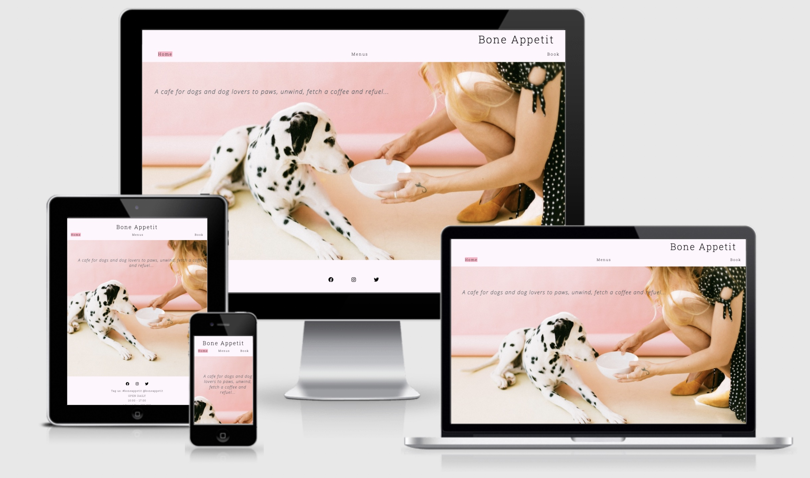
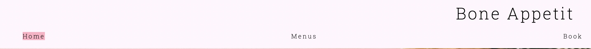
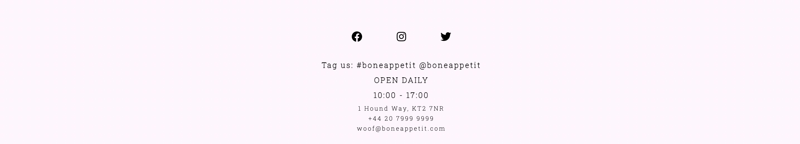
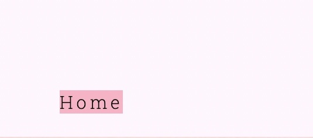
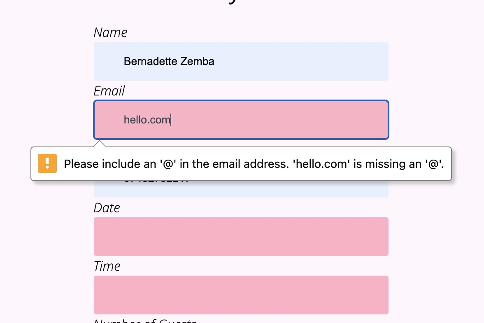

<h1 align="center">Bone Appetit</h1>

[View the live project here.](https://bzemba87.github.io/bone-appetit/)

This is a website for a dog cafe in London named Bone Appetit.  It is designed to be responsive and accessible on a selection of devices, making it easy to navigate for potential cafe customers.

<h2 align="center"></h2>

## User Experience (UX)

    - ### User stories

    - #### First Time Visitor Goals

        1.  As a first time visitor, I want to easily understand the main purpose of the site and learn more about a dog cafe in London.
        2. As a first time visitor, I want to be able to easily navigate the site to find the food menu and booking request form.
        3. As a first time visitor, I want to be able to easily find the cafe's location and visit it's social media accounts linked to the site to see their posts, posts they are tagged in by customers and how many followers they have.

        - #### Returning Visitor Goals

        1. As a returning visitor, I want to find the contact information for any general queries or queries about an existing booking I may have.
        2 As a returning visitor, I want to check if the menu has been updated.
        3. As a returning visitor, I want to visit the social media links to check any new posts.
        4.  As a returning visitor, I want to check the cafe opening hours.

        - ### Design

        - #### Colour Scheme
        - The colours I chose for Bone Appetit are #FFF6FE (very light shade of magenta); #FE94AD (light red); black and #36454F (charcoal).  As it is a cafe website, the colours have to provide a taste of the cafe's personality which is a good balance of being fun and attractive but also professional.  

        - #### Typography 
        - The Open Sans is used for the body and Roboto Slab is used for the headings and footer.  Sans-serif is selected as the fallback font if there is a problem with importing either font to the site.  Both fonts have been imported from Google Fonts and are easy to read and look nice and sleek.

        - ### Imagery
        - The background image on the home page is eye catching and relevant for a dog cafe site with a purpose to attract dog lovers.  It's modern and minimalist look sets the tone for the entire cafe.
        
        - ### Wireframes 
        - Home Page Wireframe - 
        - Menu Page Wireframe -
        - Book Page Wireframe - 

## Features 

- The site consists of 3 main pages - Home, Menus and Book.
- Each page has the same layout - Header (title/icon), Navigation Bar (links to other pages), Body (text content, images and booking form), Footer (social media icons/links, opening hours, location and contact information).

Navigation Bar:

<h2 align="center"></h2>

Footer:

<h2 align="center"></h2>

Layout and Content:

- The Home page has some welcome text and a background image.
- The Menus page has menus available in the cafe for dogs and humans plus a little note about food intolerances.
- The Book page has a booking form to reserve a table that requires name, email, phone, date, time and a dropdown menu to select number of guests.   An image is alongside the booking form.

Hover effect on links:

- Indicates to the user the location of the mouse whilst navigating the menu on the navigation bar.
- A background colour (rgba(254,148,173,0.7) has been set for active links so the user knows which page they are currently on.

<h2 align="center"></h2>

Reserve Your Table Form:

- Form validation requests user to input correct information in input fields when the 'Request Booking' button is pressed - this stops the user from submitting incorrect information.  

<h2 align="center"></h2>

