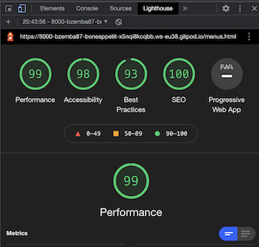

<h1 align="center">Bone Appetit</h1>

[View the live project here.](https://bzemba87.github.io/bone-appetit/)

This is a website for a dog cafe in London named Bone Appetit.  It is designed to be responsive and accessible on a selection of devices, making it easy to navigate for potential cafe customers.

<h2 align="center"></h2>

## User Experience

    User Stories

    First Time Visitor Goals

        1.  As a first time visitor, I want to easily understand the main purpose of the site and learn more about a dog cafe in London.
        2.  As a first time visitor, I want to be able to easily navigate the site to find the food menu and booking request form.
        3.  As a first time visitor, I want to be able to easily find the cafe's location and visit it's social media accounts linked to the site to see their posts, posts they are tagged in by customers and how many followers they have.

    Returning Visitor Goals

        1.  As a returning visitor, I want to find the contact information for any general queries or queries about an existing booking I may have.
        2.  As a returning visitor, I want to check if the menu has been updated.
        3.  As a returning visitor, I want to visit the social media links to check any new posts.
        4.  As a returning visitor, I want to check the cafe opening hours.

    Design

    Colour Scheme:

        - The colours I chose for Bone Appetit are #FFF6FE (very light shade of magenta); #FE94AD (light red); black and #36454F (charcoal).  As it is a cafe website, the colours have to provide a taste of the cafe's personality which is a good balance of being fun and attractive but also professional.  

    Typography:

        - The Open Sans font is used for the body and Roboto Slab font is used for the headings and footer.  Sans-serif is selected as the fallback font if there is a problem with importing either font to the site.  Both fonts have been imported from Google Fonts and are easy to read and look nice and sleek.

    Imagery:

        - The background image on the home page is eye catching and relevant for a dog cafe site with a purpose to attract dog lovers.  It's modern and minimalist look sets the tone for the entire cafe.
        
    Wireframes:
        - Home Page Wireframe - 
        - Menu Page Wireframe -
        - Book Page Wireframe - 

## Features 

- The site consists of 3 main pages - Home, Menus and Book.
- Each page has the same layout - Header (title/icon), Navigation Bar (links to other pages), Body (text content, images and booking form), Footer (social media icons/links, opening hours, location and contact information).

Navigation Bar:

<h2 align="center"></h2>

Footer:

<h2 align="center"></h2>

Layout and Content:

- The Home page has some welcome text and a background image.
- The Menus page has menus available in the cafe for dogs and humans plus a little note about food intolerances and an image.
- The Book page has a booking form to reserve a table that requires name, email, phone, date, time and a dropdown menu to select number of guests.   An image is alongside the booking form.

Hover Effect on Links:

- Indicates to the user the location of the mouse whilst navigating the menu on the navigation bar.
- A background colour (rgba(254,148,173,0.7) has been set for active links so the user knows which page they are currently on.

<h2 align="center"></h2>

Reserve Your Table Form:

- Form validation requests user to input correct information in input fields when the 'Request Booking' button is pressed - this stops the user from submitting incorrect information.  

<h2 align="center"></h2>

## Languages, Libraries and Programs Used

- [HTML5](https://en.wikipedia.org/wiki/HTML5)
- [CSS3](https://en.wikipedia.org/wiki/CSS)

- [Google Fonts:](https://fonts.google.com/)
    - Google Fonts was used to import the 'Roboto Slab' font and 'Open Sans' font into the style.css file which is used on all pages throughout the site.
- [Font Awesome:](https://fontawesome.com/)
    - Font Awesome was used in the footer for social media links on each page and on the menu page for the menu headings.

- [Git](https://git-scm.com/)
    - Git was used for version control, commiting and pushing to GitHub.
- [GitHub:](https://github.com/)
    - GitHub is used to store the repositories, files and images after being pushed from Git.

- [Balsamiq:](https://balsamiq.com/)
    - Balsamiq was used to create the [wireframes] during the design process.
- [Am I Responsive:](http://ami.responsivedesign.is)
    - Used to test responsiveness of the website at different screen sizes.

- [Pexels:](https://www.pexels.com/)
        - Obtained pictures used in website from Pexels.

- CHROME Developer tools
    - For checking compatibilty, troubleshooting and editing code.

    ## Testing

I ran my code through the W3C Markup Validator and W3C CSS Validator for every page of my site and I was given the following error on my menus.html file:

- Element < br > not allowed as a child of element < ul > (I used this for spacing between menu items on the menus page).  I have since corrected this error by removing all < br > elements and replaced them with padding for the lines that require space.  

I also had the following warning for 4 lines in my style.css file:

- Family names containing whitespace should be quoted. If quoting is omitted, any whitespace characters before and after the name are ignored and any sequence of whitespace characters inside the name is converted to a single space.

I fixed this by putting ' ' around my Roboto Slab font.  

I am now receiving no errors in my code on either validator.  

- [CSS Screenshot](https://github.com/BZemba87/bone-appetit/blob/ffe7b7a5e0e03a5ec0f8cf3d88d7b311443d054d/W3C%20CSS%20Validator%20.jpg)
- [HTML Screenshot](https://github.com/BZemba87/bone-appetit/blob/b45b6db40d4666639da298d33cef00db7ace816b/W3C%20HTML%20Validator%20Results%20.jpg)

- [W3C CSS Full Report](https://jigsaw.w3.org/css-validator/validator?uri=https%3A%2F%2Fbzemba87.github.io%2Fbone-appetit%2F&profile=css3svg&usermedium=all&warning=1&vextwarning=&lang=en)
- [W3C HTML Full Report for Home](https://validator.w3.org/nu/?doc=https%3A%2F%2Fbzemba87.github.io%2Fbone-appetit%2Findex.html)
- [W3C HTML Full Report for Menu](https://validator.w3.org/nu/?doc=https%3A%2F%2Fbzemba87.github.io%2Fbone-appetit%2Fmenus.html)
- [W3C HTML Full Report for Book](https://validator.w3.org/nu/?doc=https%3A%2F%2Fbzemba87.github.io%2Fbone-appetit%2Fbook.html)

## Testing User Stories from User Experience

### First Time Visitor Goals
1.  I want to easily understand the main purpose of the site and learn more about a dog cafe in London.
- Upon entering the site, users are greeted with easily readable welcome text explaining the purpose of the site, a clear and obvious title and a clean navigation bar to help the user go to the page of their choice.  

2.  I want to be able to easily navigate the site to find the food menu and booking request form.
- Users can instantly see the navigation bar when they arrive at the site as the font is very sleek and easy to read. With only 3 links (home, menus and book) to choose from, it becomes very easy to move around the site and find what they are looking for.  A background color activates for the link of the page the user is currently viewing.  

3.   I want to be able to easily find the cafe's location and visit it's social media accounts linked to the site to see their posts, posts they are tagged in by customers and how many followers they have.
- 

## Lighthouse

- I ran each page live through Chrome Lighthouse for Desktop and Mobile

## Home (Desktop)

<h2 align="center"></h2>

## Menus (Desktop)

<h2 align="center"></h2>

## Book (Desktop)

<h2 align="center"></h2>

## Home (Mobile)

<h2 align="center"></h2>

## Menus (Mobile)

<h2 align="center"></h2>

## Book (Mobile)

<h2 align="center"></h2>

## Accessibility 

- Each page has been tested on wave.webaim.org for accessibility.
- Click [here](https://wave.webaim.org/report#/https://bzemba87.github.io/bone-appetit/index.html) for full report

